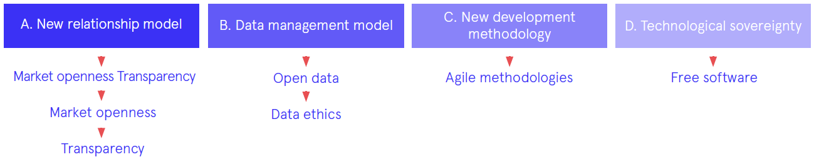
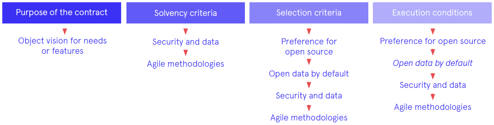
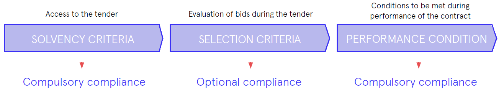

= Measures and their application to procurement
:experimental:
:icons: font
:page-partial:
:source-highlighter: highlightjs

ifndef::env-site,env-github[]
include::_attributes.adoc[]
endif::[]

include::{partialsdir}/README.adoc[tag=metadata]

== Measures to be applied in ICT service procurement

*The measures* that must be applied in the new ICT service procurement model *are based* *around four actions lines:*

*NEW RELATIONSHIP MODEL*

The traditional vision of public authority action is based on the exercise of authority according to legitimacy under the law and the legal system.
Hence, administrative procedure (and, therefore, public procurement) has been conceived as a closed and extremely regulated process.
This concept has led to an administration model that often acts in an interventionist and authoritarian manner (in the sense of acting under unilateral procedures and from a position of strength).

In terms of public procurement, *this unilateral nature has led to the following results:*

* *Acquisition of not very innovative pro-ducts and services* far from the cutting edge of the market due to the need to define all the requirements and features of the service or product prior to acquisition or selection.

* *Long and complex procedures* with a heavy administrative burden (and, therefore, significant costs for vendors) that have become an obstacle to accessing public procurement processes for small companies.
* Highly detailed and regulated contracts that are extremely rigid, which offer very little margin for adaptation to possible changes in circumstances or context during the contract term.

*However, this paradigm is changing.*
*The main lines of action being promoted by the City Council* to build this new relationship and contracting framework are explained below.

*PRELIMINARY MARKET CONSULTATIONS*

The current legal framework includes the option to launch a dialogue between the contracting authorities and the market prior to launching a contracting process.
The goal is to know and investigate the solutions being offered by the market to meet the needs that are the object of the contract.

Participation of market players during the contract preparation stage presents a series of advantages over the traditional contracting method.
Specifically, the following:

* It gives the market a *better and more in-depth understanding of the needs of the public authorities* and therefore enables the solutions proposed solutions to be better adjusted in terms of price and quality to what the public authorities require.

* It allows *the latest innovations in the* *market*, the latest open standards and latest free software to be included, which may be unknown to the public authorities, especially in highly dynamic sectors such as the field of information systems and technology.

* This is a contracting model with *more* *collaboration between the parties,* which facilitates closer ties between the public authorities and the reality of the market.

*MARKET OPENNESS*

*A more open and transparent relationship with the ICT sector, with simpler, more efficient and more accessible procurement processes* to lighten the bureaucratic burden and reduce the cost of accessing public procurement processes.

For example, make use of tender formats such as those based on framework agreements or electronic auctions, which enable the public procurement procedure to be simplified, in order to make them more accessible and less costly for bidders.

The negotiation-based tender procedure also enables essential direct contact between companies and the contracting authority, thereby guaranteeing equal treatment, to define and adapt the offers from the market to municipal needs.

Complex procedures can prevent access to public procurement by SMEs and small vendors that lack the resources needed to tackle traditional documentation and procedural requirements.

For this reason, correct tender planning is important so as to make it easier for all potentially interested parties to prepare competitive bids, as well as plan their resources and have time to make the necessary investments.

The goal of minimising these barriers is to broaden the range of vendors that work with the IMI, thereby opening up public procurement to the ecosystem of local companies and professionals with talent, helping it to strengthen and grow.

*TRANSPARENCY*

*Facilitating access* by vendors and the public to accurate and up-to-date information on the ICT contracts of the City Council, *raising the profile of public procurement processes* and *increasing transparency* has highly positive effects on the openness and accessibility of these procedures:

* The public can know how its money is being spent and under which criteria, as well as the results and objectives achieved under the contracts already completed.
* Vendors can use a single point to access all the information associated with municipal contracting (planning, contracting, criteria and evaluation measures, strategic position of the City Council, etc.) in order to make it more accessible and facilitate their resource planning.

*EXPECTED BENEFITS*

The goal of this new relationship model is to *encourage more participatory, accessible, agile and flexible contracting procedures, with the following objectives:*

* *Reduce the administrative deadlines and costs associated with tender procedures, making them more accessible* to new suppliers, especially local small- and medium-sized enterprises, which make up the core of the economic fabric.

* *Make public procurement processes more visible and increase transparency*, in order to make them more accessible and inform the public about how public resources are invested and under which criteria, as well as about the results and objectives achieved.

*Facilitate and foster the procurement of innovative products and services, in line with the strategic objectives of the City Council in terms of ICT* (technological sovereignty, use of open standards, etc.) and incorporating the latest solutions in the market.

*DATA MANAGEMENT MODEL*

*DATA SECURITY AND ETHICS*

The volume of data generated nowadays offers a series of unbeatable opportunities but also poses new security-related challenges and risks.
The City Council must ensure the security of data of the public and the city by protecting confidentiality and integrity, and guarantee quality by adding the appropriate mechanisms.

One of the challenges emerging from this new model is the balance between openness policies and the use of data and citizens privacy.
The publication of data must always ensure that citizens privacy is maintained intact, even when various data sources overlap.

The data life-cycle must ensure that every stage is developed with ethical respect for the citizens; from how data are generated, stored and shared to the procedures and purposes for which they are used.

*OPEN DATA*

The openness of public sector data (open public data) is a movement being promoted by public authorities in order to make the best use of available public resources and current technological capabilities, presenting the information generated or kept by public bodies and enabling access and re-use for the benefit of any interested person or entity.

This potentially high-value public information can relate to any topic or refer to any issue (pictographic documents, statistical data, study or analysis results, information on public services, etc.).
Companies, researchers, other public institutions or the general public can make use of the information resources for any purpose, maximising the economic and social possibilities offered by this project: fostering management transparency, improving citizen services, generating business activities and social impact, and seeking efficiency of government.

For example, sharing data associated with mobility can facilitate the creation of smarter public transport networks, leading to reduced congestion, improved mobility for all and lower energy costs.

In a democratic city, residents must be able to use the shared knowledge base and add to it.
Furthermore, active participation by the public can help resolve the challenges faced by the city.

*EXPECTED BENEFITS FROM THE NEW DATA MANAGEMENT MODEL*

The goal of this new data management model is *to enhance the value of the city’s public* *information data and infrastructure, and guarantee* (as an essential requirement) privacy and responsible use of the data associated with the public and the use of municipal public services.

A new management model for the data resulting from the operation of services, applications and the exercise of municipal powers.

The goal is to provide a public and open data infrastructure for the development of innovative data-driven applications aimed at *better access to public services and improved quality of life while guaranteeing data sovereignty for the public.*

*NEW DEVELOPMENT METHODOLOGY*

New tools and technologies enable the end of the traditional life-cycle of system development structured as a series of highly specific stages of limited scope: definition of requirements, functional design, technical design, construction, testing, user testing, production and maintenance.

This translates into a highly significant reduction in time between requirements and roll-out (production).
Generally-speaking, agile methodologies harness this reduction to *build applications more efficiently, more securely, more attractively and in a manner more focused on the needs of the end user.*

*EXPECTED BENEFITS FROM THE USE OF AGILE METHODOLOGIES*

The use of agile methodologies brings a series of advantages over traditional methodologies, especially in the field of digital service provision.
Specifically, the following:

* More focus on end users, given that they are involved in the entire design, construction and maintenance process for applications and services.

* More flexibility and greater value.
Increased flexibility in the execution conditions and encourage greater alignment between requirements and real needs.

* Facilitate and foster the procurement of innovative products and services that incorporate the latest solutions in the market.

* Shorten development times.
Implement on-going improvement.
Systemise ongoing improvement based on short review and adaptation cycles.

*  Transform the organisational culture.
Place emphasis on collaboration and transparency.

*TECHNOLOGICAL SOVEREIGNTY*

The current way ICT service are provided that is mostly based on outsourcing and the use of proprietary software has led to a certain degree of ICT vendor lock-in at Barcelona City Council.
This dependency has certain undesired effects on the cost of procuring and using information systems, and the public authorities’ ability to maintain and evolve them.
In order to reverse this situation, a series of steps are being taken:

* *Foster the priority use of free software, and open architectures and standards* in order to help reduce dependency and vendor lock-in, moving towards technological sovereignty for the City Council.
Furthermore, efforts are being made to promote and intensify the creation of solutions in a collaborative fashion with user communities and other public authorities.

This technological sovereignty – promoted with open standards – must also be a tool for the common good, generating a new economy, enriching the local ICT sector and facilitating knowledge exchange between different cities.

* *Define new contractual frameworks that take into account the required education and training of municipal technicians* involved in the software design and development projects in order to minimise dependency on third parties for the management of municipal services.

*EXPECTED BENEFITS*

The goal is to establish a preferential use of free software, and open architecture and standards, as well as to provide the City Council with the profiles and capabilities needed to regain knowledge of the ICT services associated with city management and control of digital services.
The aim of this is to acquire technological sovereignty capable of leaving this knowledge as a legacy for the city itself.
Other benefits include:

* Facilitating the re-use of systems and solutions, and improving efficiency in the contracting of information products and services.
* Reducing the costs associated with providing and procuring ICT services and products in the medium and long term.

* Guaranteeing interoperability between public authorities and between the various digital services of the City Council.

* Not forcing the public to use technology solutions from specific vendors.

* Guaranteeing technological sovereignty and independence from specific vendors (avoiding vendor lock-in), and the ability to establish proprietary and transparent policies in terms of updates, security and incident management.

* Improving the ability to adapt and expand the digital systems of the City Council as needs evolve, and guaranteeing long-term sustainability.

== Applicability of the measures to ICT procurement

*To facilitate the applicability of the strategic measures* by the City Council and the IMI described in this guide *to future ICT service contracts, the annex contains a series of criteria or conditions that can be added to specifications* (technical and administrative) *based on the scope and purpose of the contract:*

*The incorporation of these elements into a public procurement process can be done in a number of ways, as briefly explained below.*

*Incorporation as solvency criteria*

To facilitate participation by as many vendors as possible in the tender process, the criteria should be proportionate (not excessively restrictive).

The goal is to ensure that participating companies have the economic and technical solvency to provide sufficient guarantees regarding their ability to execute the contract.

*Incorporation as selection criteria*

Incorporation as selection criteria enables the value of those offers or solutions that best comply with the municipal strategy to be highlighted.
It should therefore be considered that the elements incorporated as selection criteria are optional, given that they are evaluation factors.

*Incorporation as condition for performance*

Incorporation as a condition for performance establishes an obligation for the successful bidder in the performance of the work object of the contract.
Therefore, its inclusion in this block aims to ensure that the work is carried out under the conditions and guarantees required by the municipal strategy on ICT services.
